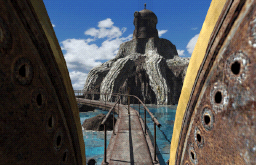
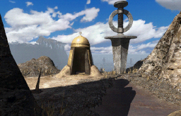
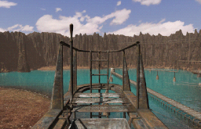
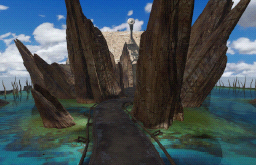

<h1> Riven DS</h1>

A homebrew port of **Riven: The Sequel to Myst** to the Nintendo DS and DSi. All
five islands, the movies, the sound and the puzzles run off an SD card or
flashcard, on real hardware or in an emulator.

**It contains no game data.** The download is the program only; a converter turns
your own copy of Riven into files the DS can read.

| | | | |
|---|---|---|---|
|  |  |  |  |

**Status: it plays.** All eight stacks are in, and every one of Riven's 131
external commands is implemented — the telescope, the marble grid, the domes, the
boiler, the pin map, the trap book, and every ending with the credits behind it.


## What you need

- A **Nintendo DS with a flashcard**, a **DSi with homebrew**, or an emulator such
  as melonDS.
- An **SD card with about 8 GB free**. The movies are stored as the raw pixels the
  DS draws, so it can play them without decoding anything — that costs 7.6 GB and
  buys a fullscreen movie that never stutters.
- **Your own copy of Riven for Windows.** The 5-CD, DVD and GOG releases are all
  detected automatically, patch archives included.
- **ffmpeg** and **ffprobe**, used to read the QuickTime movies. Install them from
  your package manager (`apt install ffmpeg`, `brew install ffmpeg`) or from
  [ffmpeg.org](https://ffmpeg.org/download.html); `--ffmpeg <path>` points at a copy
  that is not on your PATH.

## Getting it running

1. **Convert the game.** Download the archive for your system from the
   [releases page](../../releases), unpack it and run `riven-convert-gui`. The
   wizard asks where Riven is, where your SD card is, and what to convert. Expect it
   to take **hours** — it is reading every frame of every movie. It is resumable:
   stopping costs only the asset in flight, and starting again skips what is done.
2. **Copy the ROM.** Put `riven-nds-port.nds` on the same card and launch it the way
   you normally launch homebrew. The converter can place it for you — the GUI has a
   checkbox, and the CLI takes `--rom riven-nds-port.nds`.
3. **Play.** You land on Riven's own main menu; the **Riven** button at the bottom
   right starts the game.

Everything the ROM reads lives in `<card>/_nds/riven_nds/data/`, and it writes its
saves, notes and settings back there. In a hurry, two stacks are enough to see the
game start and much quicker to convert than all eight:

```bash
riven-convert --stack aspit --stack tspit /path/to/riven /path/to/sd
```

If you converted with an older build, just convert again — each stage stamps the
version it wrote and redoes itself when that no longer matches.

## Controls

The game is played with the stylus on the bottom screen. The pointer is
persistent: touching moves it, lifting leaves it where it was, and the **D-pad**
nudges it with **A** as the click — which is what gives the port *hover*, and hover
is the only thing Riven's cursor shapes are for. The books you carry sit in the band
under the card view and are touchable.

| Button | |
|---|---|
| **X** | Zoom the card to Riven's original resolution — for dials, journals and the telescope. The stylus works in there exactly as it does on the card; **R** + drag pans instead of clicking, **B** leaves |
| **Y** | Open your notebook — 24 pages you can scribble on in six colours |
| **L** | Slip a picture of what you are looking at into the notebook. Works at any moment, mid-cutscene included |
| **B** / **START** | Skip a cutscene |
| **START** | The port's menu — save, load, notebook, settings, resume. Riven's own menu card reaches the same screens |
| **SELECT** | Held, it is a developer chord: a direction replays the card with that transition. **SELECT+START** opens a command prompt with the DS keyboard |

Notes are **global, not part of a save slot**: what you wrote down is knowledge you
keep whichever game you load. There are five save slots. Settings — zip mode (off
by default, as in the original), transitions, water, master volume and a debug log —
live behind the port's menu and behind Riven's own Options button.

**Debug log** turns the top screen into a trace instead of Riven's splash, writes it
to `debug.log` on the card line by line so it survives the power switch, and swaps
**L** from taking a note to writing a screenshot. It is read once at startup.

## Building from source

```bash
git submodule update --init     # libvaht
./setup-env.sh                  # ./env: architectds + ninja
./make.sh                       # -> riven-nds-port.nds
```

You will need [BlocksDS](https://blocksds.skylyrac.net/) (installed through the
[Wonderful toolchain](https://wonderful.asie.pl/)) and [Nitro Engine
Advanced](https://github.com/Warioware64/nitro-engine) in `$BLOCKSDSEXT`.
[`.github/workflows/release.yml`](.github/workflows/release.yml) sets both up from
scratch on a clean machine, so it doubles as the exact recipe.

The converter is a separate C++ program and needs no Python:

```bash
cmake -S tools/riven-convert -B build/convert
cmake --build build/convert -j
ctest --test-dir build/convert
```

Qt 6.5+ is optional — without it the build produces the CLI and the tests and says
so. `riven-convert <source>` with no destination probes your copy of the game and
reports what it found without writing anything, and `--movie-report` lists what is
inside the movies. Several tests read a real install when you point them at one
(`RIVEN_TEST_DATA=/path/to/riven`) and skip cleanly when you don't.

## Credits

- **Cyan** — for Riven.
- **[ScummVM](https://www.scummvm.org/)** — its Mohawk engine is the reference this
  port's game logic was rebuilt from.
- **[BlocksDS](https://blocksds.skylyrac.net/)**, **[Nitro Engine
  Advanced](https://github.com/Warioware64/nitro-engine)** and
  **[ArchitectDS](https://github.com/AntonioND/architectds)** — the toolchain, the
  3D engine and the build system.
- **[libvaht](https://github.com/agrif/libvaht)** — the Mohawk archive reader the
  converter is built on.

## Legal

The code in this repository is licensed under Apache-2.0 (see [LICENSE](LICENSE)).

Riven, its artwork, music and text are the property of Cyan Worlds and are **not**
distributed here, in any form. This project only converts data you already own, on
your own machine. It is a fan project, not affiliated with or endorsed by Cyan.

The dependencies each carry their own terms, and the boundaries matter:

- **ScummVM** (GPLv2+) is used as *documentation*, never copied. Behaviour is
  reimplemented from it and every fact is cited in a comment as `file.cpp:line` so
  any claim can be checked.
- **libvaht** (LGPL-3.0) is statically linked into the converter and never into the
  ROM. The LGPL's relink requirement is met because the converter is published as
  source with libvaht as a submodule.
- **Qt 6** (LGPL-3.0) is used by the GUI only, and **must stay dynamically linked** —
  `windeployqt` on Windows and the AppImage on Linux are what satisfy that. The
  core and the CLI link no Qt at all.
- **ffmpeg** is run as a child process, never linked and never shipped. Running a
  program is not linking against it, so no ffmpeg code, header or symbol enters
  this binary and the GPL question never arises.
- **minimp3** (CC0-1.0) decodes the MPEG-2 Layer II sounds the DVD and GOG releases
  ship. Converter-side only; what reaches the card is ADPCM like everything else.
